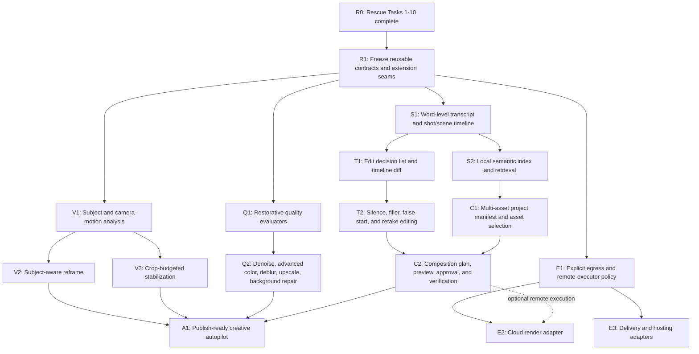

# MCP Video Post-Rescue Critical Path

> **Historical planning record:** This plan predates the Kinocut rename. Former
> package names are retained as dated evidence; the approved Kinocut trusted
> execution layer plan is the current roadmap.

**Status:** Implemented for the approved 1.6.0 planning, retrieval, verification, and
explicit-adapter scope. New media mutation remains restricted to separately approved vetted
executors, as required by the surface-parity decision. See the
[release receipt](../../proofs/release-1.6.0/RESCUE_POST_RESCUE_RECEIPT.md).

**Starts after:** `2026-07-09-dedicated-rescue-pipeline.md` Task 10 and its required final review

**Purpose:** Define the required post-rescue build program: which rescue contracts unlock each capability, which new trust boundary is required, and which work can proceed in parallel.

## BLUF

The rescue release is not the end product. It establishes the safety kernel that every larger editing feature needs:

1. versioned evidence and findings;
2. policy-owned eligibility;
3. an inspectable plan and explicit approval set;
4. bounded local execution with cancellation/resume;
5. independent verification and atomic package promotion;
6. receipts, provenance, capability discovery, and surface parity.

The shortest critical path to broad editing capability is:

```text
Rescue implementation complete
  -> rescue contract freeze and extension seams
  -> semantic timeline foundation
  -> explicit edit-decision-list planning
  -> multi-asset composition planning
  -> publish-ready creative autopilot
```

Subject-aware reframe and stabilization form a parallel visual branch. They must converge before creative autopilot, but they do not need to block transcript editing or semantic retrieval.

Cloud rendering and delivery are a separate parallel branch. They must never become a hidden fallback inside the local rescue policy.

## Dependency Graph



## Gate R0: Finish The Rescue Plan

No postponed feature should begin by bypassing unfinished rescue foundations. R0 is complete only when the current plan has delivered:

- `rescue_plan` and `rescue` schemas with additive readers;
- `local_content_preserving` policy v1;
- stable source, plan, policy, dependency, and resume mismatch errors;
- a closed operation registry with no raw filter execution;
- cancellation, quarantine, resume, and atomic promotion;
- independent preservation and package verification;
- MCP, CLI, and Python parity;
- hostile fixtures, FFmpeg matrix evidence, privacy checks, and performance receipts;
- public docs and the MCP Video agent skill.

**Exit evidence:** the release receipt from Task 10, not merely green unit tests.

## Gate R1: Freeze The Reusable Extension Seams

This is the missing bridge between the end of the rescue plan and the postponed roadmap. It should be a small follow-up design and implementation, not an unplanned refactor during the first feature.

### Required seams

1. **Policy profiles**
   - Keep `local_content_preserving` immutable.
   - Add a registry for separately versioned policies instead of adding exceptions to rescue v1.
   - Require each policy to declare timeline, crop, synthesis, network, and source-overwrite permissions.

2. **Intent-plan envelope**
   - Reuse evidence, confidence, disposition, approvals, versions, hashes, and package intents.
   - Allow feature-specific payloads such as crop tracks, edit decisions, asset selections, or remote jobs.
   - Do not prematurely replace `RescuePlan`; define an additive envelope that can contain it.

3. **Verifier registry**
   - Preserve rescue's mandatory checks.
   - Permit a feature to add checks without suppressing source integrity, decode, timing, privacy, and persisted-hash checks.
   - Make policy identify which checks are gating.

4. **Executor capability registry**
   - Extend `doctor` capability snapshots with executor/model identity, version, hardware, and determinism scope.
   - Never install, download, or silently substitute an executor during planning or rendering.

5. **Preview and approval diff**
   - Standardize before/after previews and a machine-readable description of what changes.
   - Require the approval receipt to bind the exact plan hash and selected action IDs.

**R1 exit gate:** one synthetic extension proves a new policy and feature-specific verifier can be added without modifying `local_content_preserving` behavior or existing rescue receipts.

## Highest-Fan-Out Branch: Semantic Timeline Foundation

Semantic understanding is the most important next platform investment because it unlocks four postponed features: transcript editing, semantic retrieval, multi-asset composition, and creative autopilot.

### S1: Canonical media timeline

Build a local, versioned analysis artifact containing:

- word-level transcript spans with confidence and model provenance;
- speaker spans when locally available, with uncertainty preserved;
- shots, scenes, silence regions, audio events, and keyframes;
- source-time coordinates that survive derived renders;
- stable IDs and hashes for every span;
- no edit decisions and no generated descriptions presented as source truth.

**Depends on rescue:** source identity, capabilities, local-only execution, metrics, plan hashing, receipts.

**New verification:** every semantic span maps to valid source time; uncertain text stays uncertain; repeated analysis is stable within the declared model scope.

### S2: Local semantic index and retrieval

Add a local index over transcript, shot, scene, and visual embeddings. Queries return source-backed spans and confidence, not invented clip descriptions.

**Depends on:** S1 stable span IDs and provenance.

**Unlocks:** "find the part where...", asset discovery for composition, evidence-backed B-roll selection, and retrieval across a project library.

**Not required for:** basic single-clip transcript deletion after S1.

### T1: Edit decision list and timeline diff

Introduce a versioned edit decision list (EDL) that references S1 spans instead of directly mutating media. Every deletion, retention, reorder, speed change, or replacement is visible in a timeline diff before render.

**New policy:** `local_timeline_editing` v1. It may permit explicit cuts but must continue to block synthetic speech, hidden reordering, source overwrite, and network use.

**Required approval:** exact EDL hash plus selected edit IDs.

**New verification:** output-to-source coverage map, approved deletion coverage, ordering, A/V sync, caption remap, and no unapproved time removal.

### T2: Ordinary-person timeline behaviors

Only after T1 is proven should MCP Video enable:

- silence shortening/removal;
- filler-word removal;
- false-start and retake selection;
- pacing cleanup;
- transcript-based trim and reorder.

Each behavior is an EDL generator, not a privileged renderer. This prevents six separate tools from inventing six incompatible timeline contracts.

## Parallel Visual Branch: Subject-Aware Reframe And Stabilization

### V1: Subject and camera-motion analysis

Create tracked, confidence-scored subject boxes, face/pose landmarks where local capabilities allow, camera-motion vectors, safe regions, and a frame-by-frame crop-loss estimate.

**Depends on rescue:** bounded sampled analysis, capability reporting, previews, metrics, abstention, source hashes.

**New safeguards:** do not infer identity; do not treat face detection as permission to crop; surface tracking loss and multiple-subject ambiguity.

### V2: Subject-aware reframe

Add crop-track plans for target aspect ratios with representative previews and a crop-loss budget.

**New policy:** `local_visual_transform` v1, permitting approved spatial crop while keeping timeline, speech, source, synthesis, and network locks.

**New verification:** subject coverage, text/safe-zone coverage, crop continuity, resolution floor, no unauthorized timeline change.

### V3: Advanced stabilization

Use the same camera/subject analysis and crop budget. Stabilization that exceeds the approved crop budget abstains or returns a recommendation.

**New verification:** measured motion reduction, crop budget, subject retention, border absence, duration and sync preservation.

V2 and V3 should share V1. Building independent trackers would create inconsistent evidence and doubled runtime.

## Restorative Quality Branch

These features were postponed because an available FFmpeg filter or local model is not enough to make a repair trustworthy.

| Deferred feature | Missing prerequisite | Promotion gate |
|---|---|---|
| Speech denoise for wind/hum/echo | noise-type and SNR evidence; speech intelligibility metric | noise decreases without speech coverage/intelligibility regression |
| Advanced white balance/color/HDR | calibrated color-space metrics; skin/neutral-region evidence | gamut, clipping, skin/neutral stability, and declared delivery profile pass |
| Deblur/upscale/frame repair | model provenance; temporal consistency and hallucination checks | identity/object continuity and no invented detail claim |
| Background cleanup/replacement | segmentation confidence; foreground/object coverage | no subject loss, edge instability, or invented background under restorative policy |
| Burned/styled captions | caption-layout plan and text safe-zone verifier | approved style, readable contrast, no clipping, timing remains valid |

These can begin after R1 and proceed in parallel with S1/V1. They are not on the shortest path to transcript editing, but production-ready creative autopilot should not claim them until their own verifier gates exist.

## Multi-Asset Composition Branch

The existing workflow/compositor work is an execution primitive, not yet an ordinary-person composition product. The missing layer is a source-backed project plan.

### C1: Project manifest and asset selection

- Bind every source asset to hashes, rights/provenance metadata, semantic spans, quality findings, and role candidates.
- Use S2 retrieval for evidence-backed selection.
- Keep user-supplied music, logos, fonts, captions, and brand constraints explicit.

### C2: Composition plan and verifier

- Convert an intent such as "make a 60-second recap" into selected source spans, layout, graphics, audio mix, captions, and output variants.
- Produce a storyboard/timeline preview and approval diff before rendering.
- Compile only to existing vetted workflow/compositor operations plus separately approved new operations.
- Verify source attribution, approved timeline coverage, audio mix, text layout, branding, variant contracts, and output package integrity.

**Depends on:** S2 for selection, T1 for source-time edits, rescue/R1 for plans and receipts, existing workflow/compositor for rendering.

**Does not require:** cloud rendering.

## Publish-Ready Creative Autopilot

Creative autopilot is a coordinator over proven planners, not a new unrestricted renderer.

It is ready only after these converge:

- V2/V3 for spatial decisions;
- T2 for ordinary-person timeline cleanup;
- S2 for source understanding and retrieval;
- C2 for multi-asset composition and variants;
- any advertised Q2 restorative features with independent verification;
- a new `local_creative_autopilot` policy defining permitted invention, asset sourcing, timeline edits, and approval checkpoints.

The first autopilot should still emit a plan and preview. "Autopilot" may reduce interaction, but it must not erase provenance or silently broaden permissions.

## Cloud Render, Delivery, And Hosting

Cloud support is not on the local feature critical path. It is an optional branch after the package contract is stable.

### E1: Explicit egress policy

- Separate network permission from creative permission.
- Show exactly which files, metadata, and hashes leave the machine.
- Require explicit provider, region where known, retention policy, estimated cost, and approval.
- Redact credentials from every plan, log, and receipt.

### E2/E3: Provider adapters

- Map a local, verified plan to a remote job without changing its creative intent.
- Record provider job IDs, versions, costs, retries, downloaded artifact hashes, and deletion status.
- Verify downloaded outputs locally before package promotion.
- Never use cloud as fallback when a local executor is missing.

Cloud delivery may ship before creative autopilot if users need hosting, but it does not accelerate the safety-critical semantic/timeline/composition path.

## Recommended Execution Order

### Wave 0: Complete and release rescue

Finish Tasks 1-10 and the required final review. Freeze the release receipt.

### Wave 1: Build the bridge

Design and implement R1 policy profiles, intent envelope, verifier registry, capability registry, and approval diff.

### Wave 2: Run two foundation tracks in parallel

- Track A: S1 canonical semantic timeline, then S2 local retrieval.
- Track B: V1 subject/camera analysis, then V2/V3 reframe and stabilization.
- Optional Track C: the highest-value restorative evaluator, beginning with speech denoise.

### Wave 3: Make timeline edits explicit

Implement T1 EDL/diff and its verifier, then T2 silence/filler/false-start/retake behaviors.

### Wave 4: Compose projects

Implement C1 project manifests and source selection, then C2 composition planning, previews, variants, and verification.

### Wave 5: Add creative autopilot

Coordinate only the proven planners and operations under a separately approved creative policy.

### Parallel wave: Optional cloud adapters

Start E1 after the package schema is stable. E2/E3 can proceed without blocking Waves 2-5.

## Hard Critical Path

For the broadest promised capability, the hard path is:

```text
R0 Rescue release
  -> R1 extension seams
  -> S1 semantic timeline
       -> T1 edit decision list -> T2 ordinary-person timeline edits ----+
       -> S2 semantic retrieval -> C1 project manifest and selection ----+
                                                                         |
                                      T2 + C1 -> C2 composition planner --+
                                                                         |
                         C2 + V2/V3 + advertised Q2 -> A1 creative autopilot
```

V1 -> V2/V3 runs in parallel with S1 -> T2 but must finish before A1 claims automatic reframing or stabilization. Q1 -> Q2 is feature-specific and joins A1 only for the restorative behaviors actually advertised. E1 -> E2/E3 remains independent unless a particular release explicitly promises cloud execution or delivery.

## Immediate Next Artifact

After the rescue implementation is complete, write one short R1 design spec before opening feature implementation branches. Its acceptance test should prove that a toy non-rescue policy can add one feature-specific payload and verifier while all `local_content_preserving` rescue fixtures remain byte-for-byte contract compatible.
